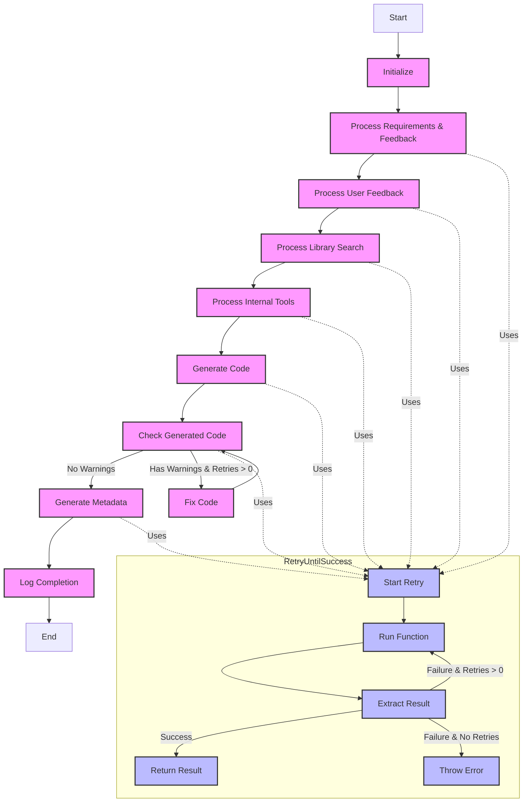

# Shinkai Prompt Testing

## Requirements 
* Shinkai Node running
* Ollama running
* Firecrawl running
* Deno 2.x

## Install
```
git clone git@github.com:dcSpark/shinkai-prompt-test.git 
cd shinkai-prompt-test
ollama pull llama3.1:8b-instruct-q4_1  # for quick iterations
ollama pull deepseek-r1:32b            # for full testing 
cp .env.example .env
```
> setup BRAVE_API_KEY and other keys in .env

## Run Prompts & Execute Results
```
deno -A src/index.ts
```

## Pipeline Flow Diagram



The diagram above shows the main pipeline flow of the Shinkai prompt testing system. Each major step in the pipeline utilizes the `retryUntilSuccess` mechanism (shown in the subgraph) to ensure robust execution. The retry mechanism will attempt the operation up to 3 times before failing.

Key components:
- Main Pipeline Flow: Shows the sequential processing steps from initialization to completion
- RetryUntilSuccess: Demonstrates the self-looping retry mechanism used by most pipeline steps
- Warning Handling: Illustrates the code fix loop that occurs when warnings are detected
- Integration Points: Dotted lines show where the retry mechanism is utilized in the main flow